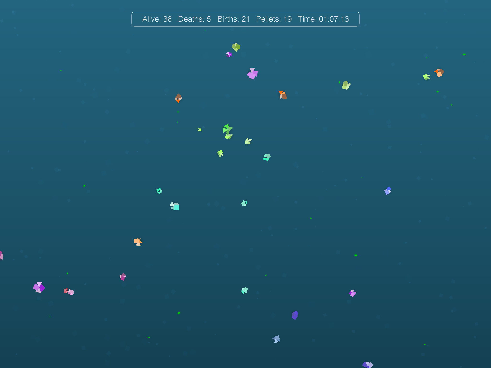
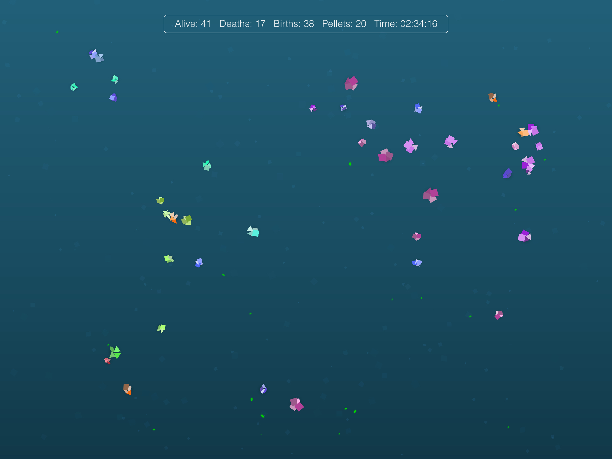

Since I was a kid I've been pretty intrigued by artificial life simulations. It started most predictably with Tamagotchi, but when I got a PC in the mid-90's I learned that there were people out there interested in making their own, more elaborate, versions of artificial life. One that's still available today is [Gene Pool](http://www.swimbots.com), and I remember one that consisted of a 3D modelled woman who wandered around a sparsely populated landscape (though I can't remember what it was called).

My favorite was called Alife Tank HAKONIWA, which is supposedly still available on some download sites if you're running Windows. It gave you a side-view of an extendible tank that housed a lot of randomly generated creatures that swam around, ate, and mated. Something about this one really appealed to me, though the creatures were often too small to identify easily and whether there was any actual decision making going on was pretty inscrutable. 

About two years ago, I decided to tackle my own simple version as a learning project to strengthen my programming skills. I'd watched a tutorial and learned that SpriteKit was extremely easy to work with, so it seemed like a no brainer to use it. I spent about a week getting a basic version working, showed it off a bit to co-workers, then forgot about it until I decided to flesh out my GitHub profile with more projects. I decided to play with it a bit at that point, but the code was such a horrible mess that I got discouraged and forgot about it yet again.

Since then, it's been forked twice, and starred twice, on GitHub. It's not a lot of attention, but I figured if people were going to play with it, I might as well clean up the code using the skills I have now.

## Wait, so... *what* is Aeon Garden?

I suppose trying to describe what Aeon Garden is in text is kind of silly, it's probably easier to get what it is by seeing it in action, so here's a video.

<iframe width="560" height="315" src="https://www.youtube.com/embed/z8q0lP9vdbY" frameborder="0" allow="accelerometer; autoplay; encrypted-media; gyroscope; picture-in-picture" allowfullscreen></iframe>

 

You can see the resemblance to Gene Pool almost certainly. With that out of the way, here's some of what I've done to try to clean up the code base and why. If you don't care about any of that, just go [check out the project on GitHub](https://github.com/amiantos/aeongarden/)!

## Refactoring Creature Generation

In my first draft, creature generation was extremely sloppy with a lot of repeated code. Basically, a creature could be generated either "from scratch" or "from parents", and both of these `init` methods have one key difference between them: in one case, the creature is generated from scratch, and in another it's generated using attributes belonging to its parents.

When I originally wrote the code, I was in a rush so instead of taking the time to consider what aspects of the process are shared, and carefully creating reusable blocks of code to share between them, I hastily ended up writing two entirely separate, long-winded functions. You can see the original "create from scratch" method [on line 93 through 352](https://github.com/amiantos/aeongarden/blob/8691149a286852f64ba6cb2800e79d11239db33c/Aeon%20Garden/Classes/AeonCreatureNode.swift#L93), and the original "create with parents" [on line 354 through 692](https://github.com/amiantos/aeongarden/blob/8691149a286852f64ba6cb2800e79d11239db33c/Aeon%20Garden/Classes/AeonCreatureNode.swift#L354). Yup, that's two functions totalling nearly 600 lines.

Not only are these functions simply way too long which makes understanding and maintaining them difficult, having two separate functions that do nearly the same thing means that when I wanted to make a change to how creatures were generated, I would likely have to make the change in two places. This means I'd always be at risk of forgetting to make the change in both places, introducing inconsistencies.

I decided that I would tackle limb generation first, since this was essentially the entirety of the `init` methods, and it didn't make a lot of sense that I was doing _the exact same thing, repeated four times_ for each limb. I honestly don't know what I was thinking years ago, I mean, aside from "Who cares how bad this code is, no one will ever see it". After thinking about what goes into each limb, I ended up with [a very clean Limb class](https://github.com/amiantos/aeongarden/blob/97073bc243a55084635847dd4420a6e8eddedad0/Aeon%20Garden/Nodes/AeonCreature/AeonCreatureLimb.swift) totalling ~70 lines. Yes, I replaced roughly 300 lines of repetitive code with just 70.

After replacing the limb generation with the classes, it was relatively simple to break the rest of the creature `init` methods into reusable methods. These pertain to placing the limbs on the body: `setupLimbs()` and creating the physics body: `setupBodyPhysics()`. At the end of my refactoring, _both_ creature generation methods now run from [line 72 through 127](https://github.com/amiantos/aeongarden/blob/97073bc243a55084635847dd4420a6e8eddedad0/Aeon%20Garden/Nodes/AeonCreature/AeonCreatureNode.swift#L72), which is an improvement of ~550 lines!

Not only did this make the creature creation process easier to understand, but it makes changing aspects of limb generation far easier than before. Instead of changing one thing in several different places, I can make one change in one file and rest easy that I didn't miss anything.

## If I Only Had a Brain...

Another big problem I had was with the way my creatures made decisions. All of this was baked into one large `think()` method, which ran [from line 694 through 827](https://github.com/amiantos/aeongarden/blob/8691149a286852f64ba6cb2800e79d11239db33c/Aeon%20Garden/Classes/AeonCreatureNode.swift#L694). Only 133 lines, but SwiftLint was very unhappy about the large number of `if` statements in it. It's actually hard to count them, especially once you factor in the various `for` loops further nested inside of it, but there's more than 10.

I figured if I was tackling this as an attempt to design the creatures in a more object-oriented way by separating the limbs from the rest of the body, I should probably refactor all the decision-making into a separate class that we can call a brain.

Creating the brain ended up being more involved, mostly because I had to make some decisions (which are still in flux) about how to divide up the responsibilities between the _brain_ and the _body_. It made some sense to me that the body should be in charge of locomotion, health, and sensory data; while the brain should be in charge of analysis and decision making.

In practice, I ended up using the delegate pattern to set up a communication channel between the brain and the body, as the brain needs to be able to request sensory data from the body (like current health, and details of creatures or food around it), while also sending the details of decisions back to the body (like current food or creature target).

On top of that, I started to explore whether using a [GKStateMachine](https://developer.apple.com/documentation/gameplaykit/gkstatemachine) would be more beneficial to use over my implementation of an extremely simple state machine. Long story short, at the moment there's no particular benefit, but it was a fun exercise and did result in some better code organization. In the current generation my [AeonCreatureBrain class](https://github.com/amiantos/aeongarden/blob/97073bc243a55084635847dd4420a6e8eddedad0/Aeon%20Garden/Nodes/AeonCreature/AeonCreatureBrain.swift) contains all the methods pertaining to decision making, and every brain has a (largely unnecessary) state machine that uses the states listed in [AeonCreatureStates.swift](https://github.com/amiantos/aeongarden/blob/97073bc243a55084635847dd4420a6e8eddedad0/Aeon%20Garden/Nodes/AeonCreature/AeonCreatureStates.swift) to decide which decision making methods need to be called.

In the end, this ends up being a larger number of lines total, but has made the code easier to maintain and understand. It's now much easier to make changes to how creatures make decisions about their behavior, because all the logic is compartmentalized into separate methods instead of being jumbled together into one large series of `if` statements.

## The Future?

While I feel like I have done a lot to make Aeon Garden easier to read and maintain, there's still a long way to go. In some cases the creature's body is still involved in some decision making, and there's still code in there I have yet to try to clean up.

Cleaning up the code base will not only make it easier for me to explore ideas I have for making the creatures more interesting to watch, but it will make it easier to add the features necessary to turn Aeon Garden into a full-fledged app (complete with the ability to save a tank, manually modify tank attributes to engage in your own experiments, save and copy creatures between tanks, and so on).

I've already made many adjustments to how creatures think and interact. In the past I had a big problem with tanks becoming far too homogenous when left running overnight, but some of the changes I've made recently have brought about more interesting outcomes, with creatures of various colors managing to survive and forming into natural little groups.

Here are some screenshots showing how a tank can progress, with a little over an hour of run time separating them.

If you enjoyed this or are interested in trying out Aeon Garden for yourself, [please star the repo on GitHub!](https://github.com/amiantos/aeongarden/)