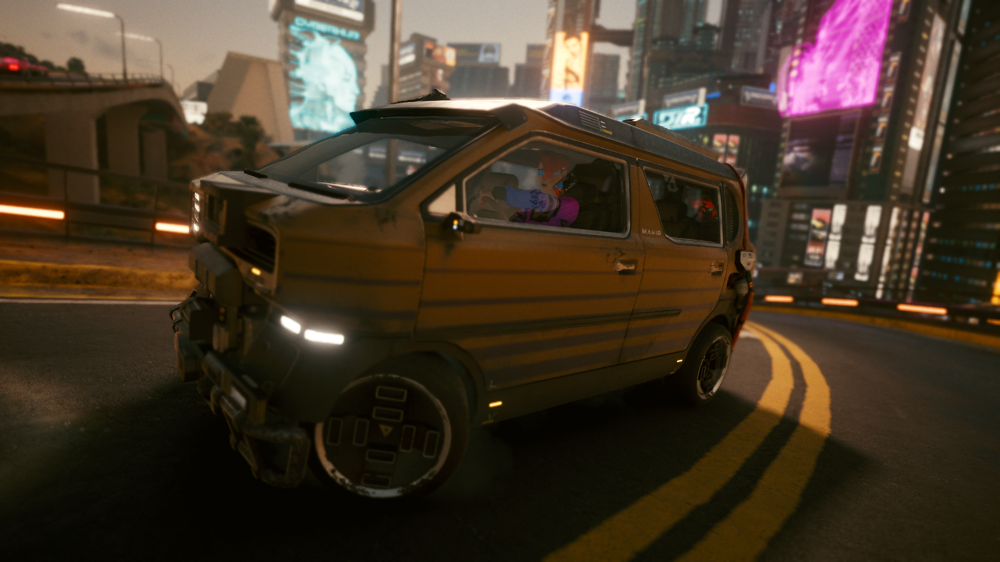
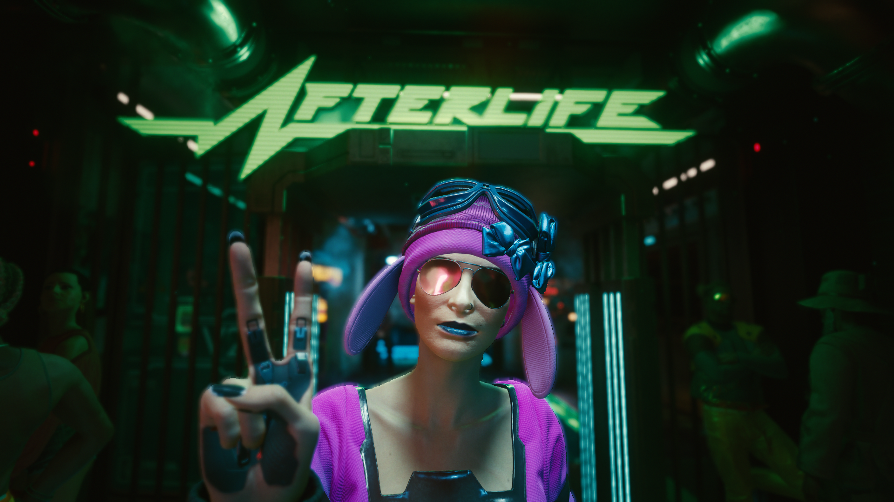
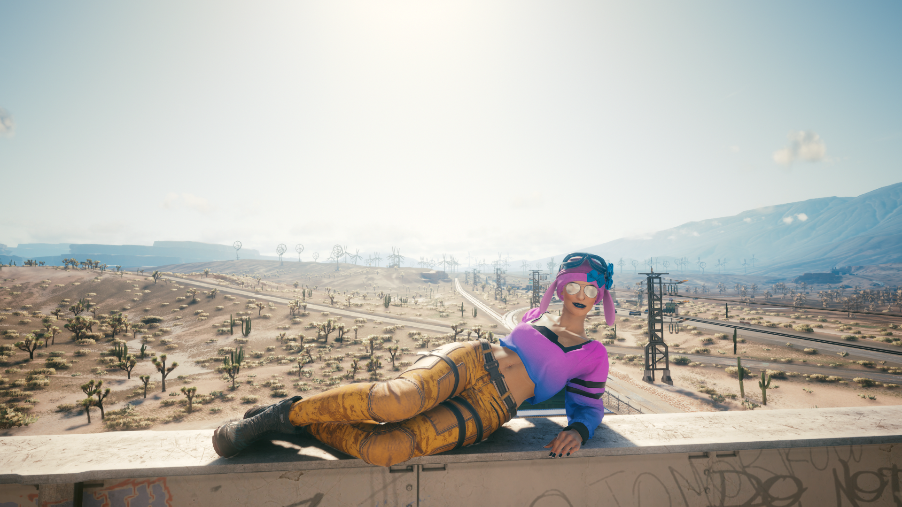
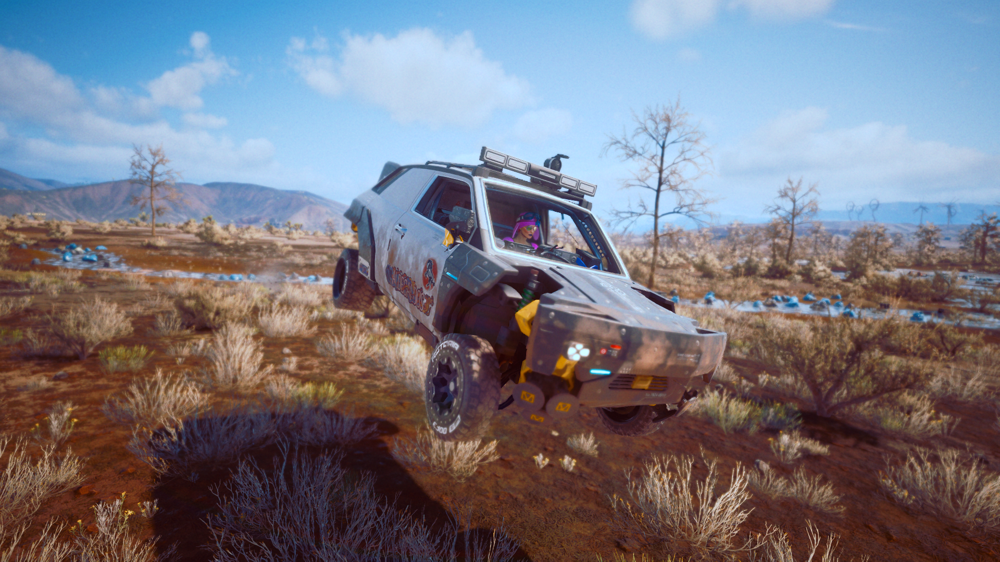
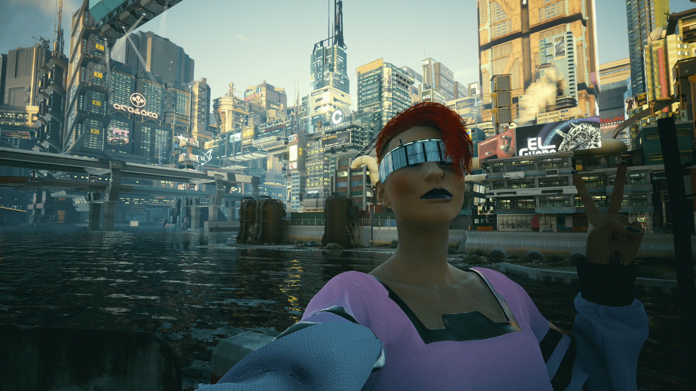
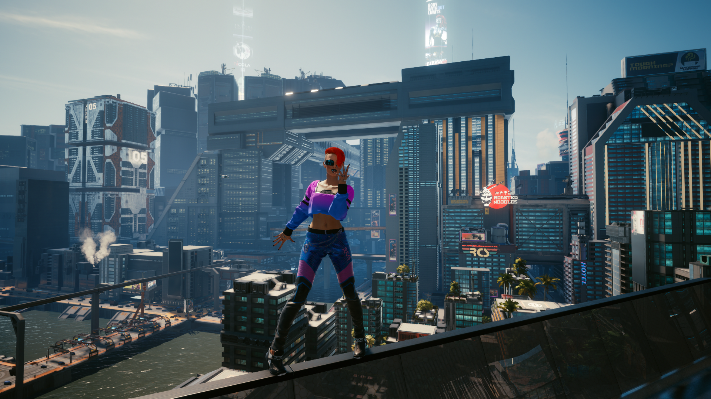

Cyberpunk 2077 is quite an achievement. Is it absolutely perfect? No. But the ways it's not perfect can (and likely will) be fixed with patches. Will it ever live up the absurd levels of marketing hype? Probably not, but that's okay. The hype was ridiculous, and the ways it has fallen short of it are fairly unimportant to the gameplay in my opinion.

The main thing about Cyberpunk 2077 is how immaculately set-dressed the world is. Nearly every accessible part of the world is just a huge mess of garbage and grime, but also things of technological beauty. The amount of detail and design work put into the drivable vehicles alone is mind-boggling. Cyberpunk's rendering of a large capitalist dystopia is akin to Red Dead Redemption 2's rendering of the American west. It's basically the perfect idea of these places. Is it 100% realistic? No, it's the theme park version, but isn't that better?

The nicest graphics in the world wouldn't save the game if the gameplay wasn't fun, and Cyberpunk delivers there as well. The gunplay feels great, very punchy and visceral. The RPG progression eventually turns you into an overpowered unstoppable murder machine, but isn't that how it should be? You start off having to hit people 5 times in the head to kill them, and by the end you're doing somersaults and slicing people's heads off with retractable mantis blades. Sounds about right to me.

The main story and the sub-stories that compose the bulk of your first 40 hours in Night City are the glue that holds the whole thing together. The main storyline is fairly interesting, and some of the other storylines definitely go interesting places, but it's mainly the characters that actually make you feel things here and there. Sometimes that might be annoyance when the characters make mistakes despite your best efforts, or admiration when you see another side of a character you didn't expect.

Cyberpunk is unfortunately a buggy game, with some rough edges here and there. I don't think the bugs I've encountered are anything worse than you usually get with a game of this scale, but we're in an age of the internet where every minor complaint must be amplified until it becomes a scandal that must be brought up every time the game is mentioned. That's too bad, because it almost prevented me from getting the game. That said, maybe all the negative hype on release helped me adjust my expectations, so that I've been able to enjoy what is a monumental achievement, instead of sitting around nitpicking it to death.

As a bonus, here's some pictures I took with photo mode while I played the game. There shouldn't be any spoilers.

