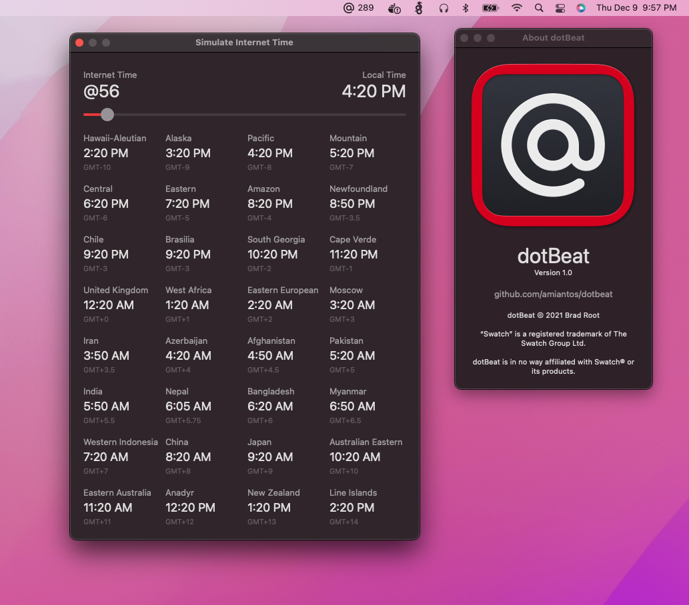

This week on stream I built a small macOS menu bar app I'm calling **dotBeat Internet Time**. It's a small, focused app with two features: 1) It displays the current Swatch Internet Time in the menu bar, and 2) It allows you to figure out how Internet Time corresponds to your local time, as well as most of the timezones on earth.

What is **Internet Time**? Back in 1998, Swatch (the Swiss watch company) thought that in our rapidly globalizing world of the early internet, a globalized method of telling the time was necessary. They decided that each 24 hour period would be broken up into 1000 ".beats" instead of 1440 minutes, and that they would start counting from midnight "BMT" (GMT+1). These beats are notated with an @ symbol. So for example, @42 is 4:00 PM local time in California, but it's 5:45 AM the next day in Nepal.

You can [download it for free](https://github.com/amiantos/dotbeat/releases) from the releases page on GitHub.

You can also [buy it on the Mac App Store for $1.99](https://apps.apple.com/us/app/dotbeat-internet-time/id1599168929), if you want to be nice and show some support for me as a developer.

The app, like my others, [is open source](https://github.com/amiantos/dotbeat).

I'll talk about my inspiration for it and process behind it on Sunday's WIUT post. See you then!