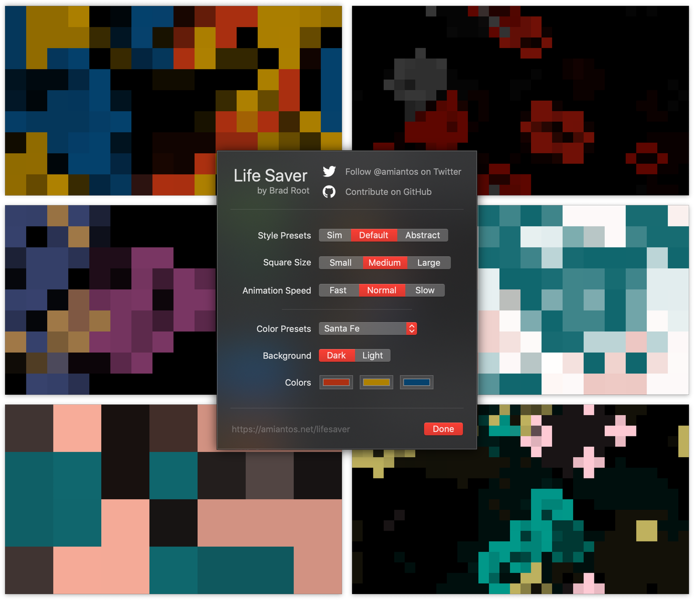

Life Saver is an abstract macOS screensaver based on [Conway's Game of Life](https://www.github.com/amiantos/lifesaver). With a variety of settings and color schemes, Life Saver should satisfy designers and geeks alike.

<iframe width="560" height="315" src="https://www.youtube.com/embed/N4nCFUVThgg" frameborder="0" allow="accelerometer; autoplay; encrypted-media; gyroscope; picture-in-picture" allowfullscreen></iframe>

 

## 
 **[Download Life Saver v1.0 for macOS](https://s3.amazonaws.com/amiantos/lifesaver-1.0.pkg)** 

* Life Saver is free, open source software. If you like it, please [star it on GitHub](https://www.github.com/amiantos/lifesaver).
* If you'd like to know more about Life Saver's development, check the ["lifesaver" tag](http://localhost:8000/tags/lifesaver/) on this here blog.
* If you _really like_ Life Saver, consider [becoming a patron](https://www.patreon.com/amiantos) so I know you're into it and want more like it.