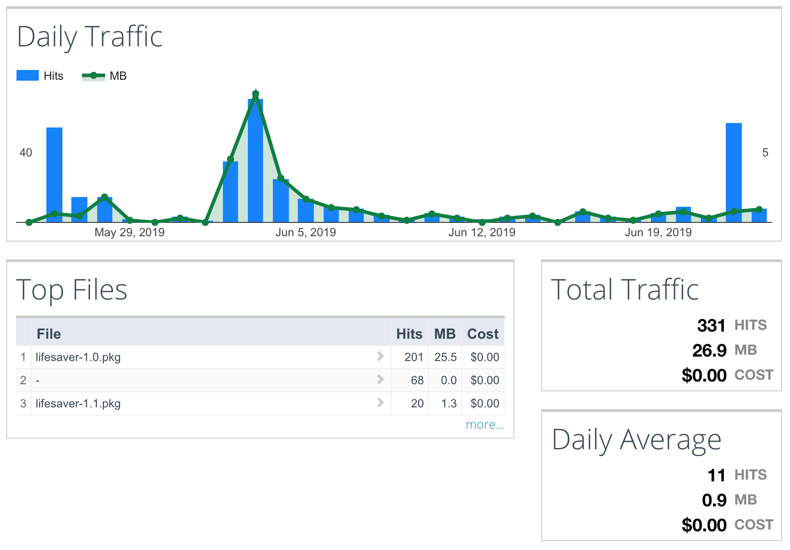
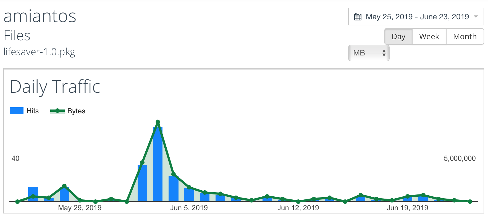
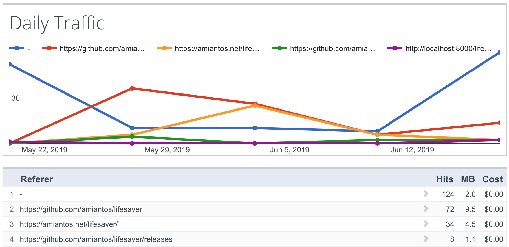

When I finished [Life Saver](/lifesaver) it seemed obvious to host the downloads on S3, like the rest of the site. But I wanted to be able to track how many times it had been downloaded, and S3 doens't have this functionality built in. Coming from a traditional web background (Apache, cPanel, etc) I wasn't sure where to start, but luckily I saw a StackOverflow answer that pointed me toward [S3stat](https://www.S3stat.com).

What's really great about S3stat is that it has [a nice macOS utility](https://www.S3stat.com/Setup/Download.aspx) to help setup all the complicated AWS stuff for you. One S3stat up and running on your bucket, you get a nice looking dashboard showing you tons of info. As an example, here's the current daily stats for my bucket. (Note that I really only host two files there.)

You can drill down into individual files to see stats for that specific file:

One feature I like a lot is that it also shows you referrers, so I can see how people are getting to my file just in case any blogs or websites directly link to it (which hasn't happened yet). Between this, GitHub's traffic stats, and Google Analytics, I have a pretty complete view of where my traffic is coming from and how effective my site is.

The S3stat service is normally $10/mo, and as an open source developer with no commercial products under my belt, I can't really bring myself to shell out even that amount of money for it. Luckily, the owner of S3stat is a generous soul and is willing to extend my free trial into perpetuity (or until I am rolling in open source riches and can pay for it myself). Many thanks to S3stat for giving me a way to gain some insight into how frequently my files are downloaded!

Check it out at [https://www.s3stat.com](https://www.s3stat.com/)!