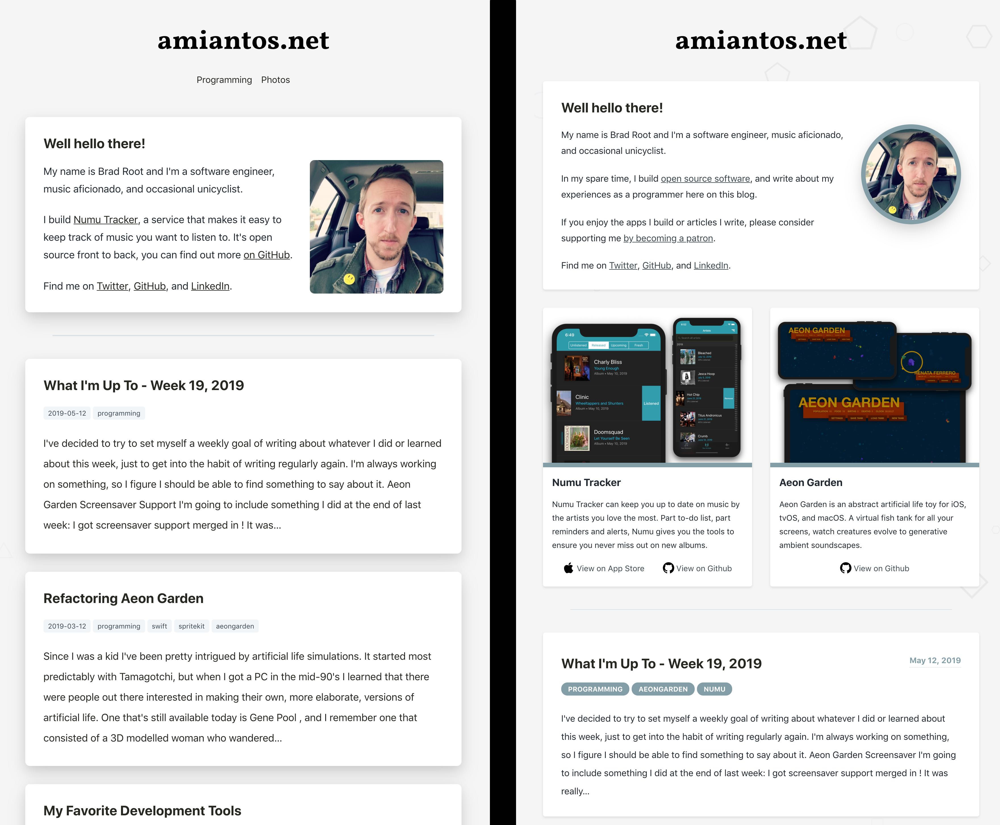

Hi! Welcome, this is my weekly post where I talk about, well, what I did over the course of the week.

---

## Life Saver

After showing Aeon Garden at work I ended up talking about artificial life with a co-worker who'd asked if I'd ever heard of [Conway's Game of Life](https://en.wikipedia.org/wiki/Conway%27s_Game_of_Life). I had been kicking around the idea of creating a simple Game of Life implementation somehow, but all the Life apps on the app store are pretty nice and I didn't really want to create an entire app (I have enough on my plate with Numu 2.0 &amp; Aeon Garden 1.0 both in early-mid stages of development) so it seemed like a non-starter even though the universe was pushing it into my face.

But then I started thinking about building more screensavers with SpriteKit, an idea spurred on by a co-worker who was interested in screensaver development. On top of that I started to feel a little burned out by these long-term projects I've been working on, and I felt that I needed a small project to serve as an encouraging [small win](http://smallwinsinnovation.com/small-wins/). I figured I could combine these two desires and create a Game of Life screensaver, so that's what I did yesterday... presenting [Life Saver](https://github.com/amiantos/lifesaver)!

<iframe width="560" height="315" src="https://www.youtube.com/embed/_G7aavJIZmw" frameborder="0" allow="accelerometer; autoplay; encrypted-media; gyroscope; picture-in-picture" allowfullscreen></iframe>

 

This is the most basic working version of the idea, stuck at the default speed and color settings. The final version will have an options panel where you can select different color options (or define your own) as well as the speed and relative size of the squares. I think I'll be able to throw these features in next weekend and call it finished.

There's a lot of potential for optimization. I'm going to try to optimize it my own way, but it seems like the be-all-end-all of life optimization is something called _Hashlife_, there's [a really nice looking iOS Game of Life app](https://github.com/JiachenRen/hashlife) that implements it in Swift. If at some point I decide I want to try to understand it so I can implement it myself, that'll be a good starting place.

If you want to download Life Saver v0.1, you can [over in the Releases on GitHub](https://github.com/amiantos/lifesaver/releases/tag/v0.1-alpha). I'm assuming it should just work...

---

## Website Updates

After writing the "What I'm Up To" for last week, I realized I wasn't particularly happy with the way this blog looked, so I spent some time over the week sprucing it up a bit. Here's a side-by-side before and after picture...

Some changes are more noticable on bigger screens, becaue I reduced the font size of blog posts by quite a bit. Other changes are more obvious, like the greatly reduced shadowing, reduced corner radius on blocks, and rearranging blog metadata to be a bit more pleasing to the eye.

The stars of the show are the new blocks promoting my open source projects. I've been conflicted thinking I should treat *amiantos.net* as my blog and *bradroot.me* as my portfolio, but I figured since this blog is where most people will land to ingest my stuff, I should probably consolidate everything onto here. Updating my about box and adding these product boxes was step one on that journey. The code itself is still a mess and needs refactoring, but it's a good first draft. Eventually I'll put these underneath the about box on every blog post, just to be thorough.

Along the way I removed all the photo posts (this is meant to be a blog and not a photolog) and ended up removing the little 'menu' at the top of the screen since I figured it was pretty much useless.

---

## What's Next?

Next week I'll just be trying to finish up Life Saver and then I'm not totally sure what I'll be turning my attention back toward. Both Aeon Garden and Numu are in desperate need of my focus, but I feel like I could use a little break. I guess we'll see!

See ya next week.
