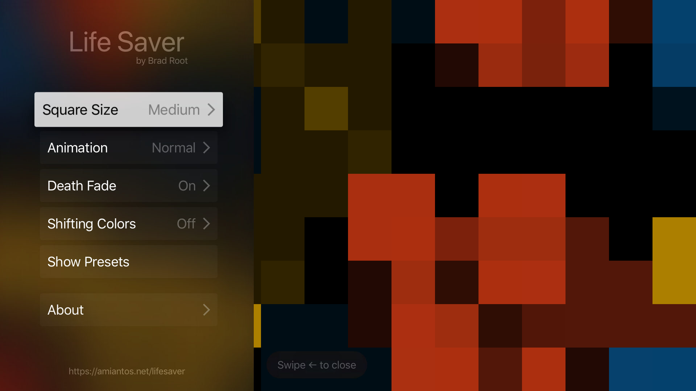
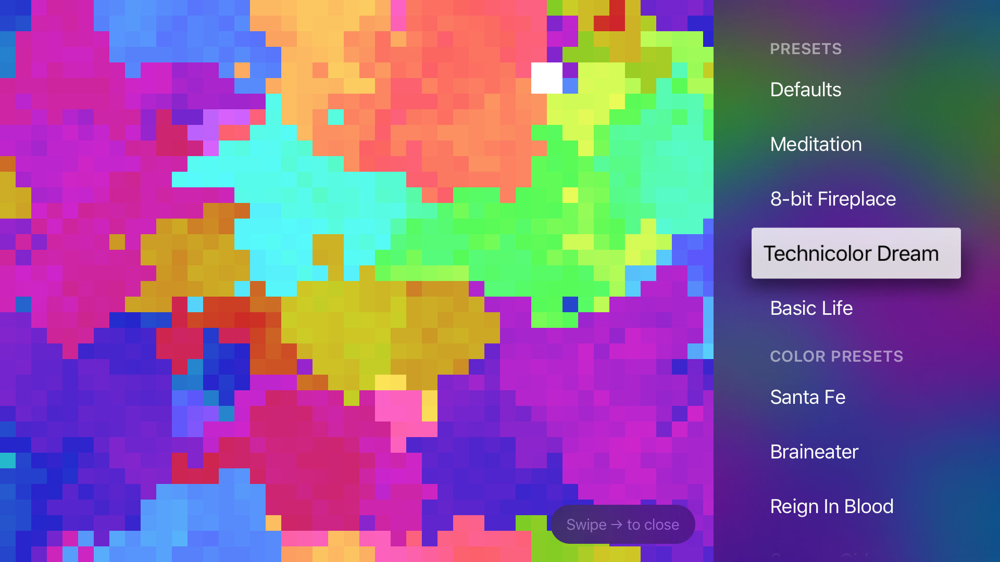

Hi! Welcome, this is my weekly post where I talk about what I did over the course of the week. This week I mostly focused on getting Life Saver ready for a tvOS release.

---

## Life Saver TV

Last week I talked about how I began work on Life Saver for the Apple TV, and that I was conflicted between programmatic UI or using storyboards. I ended up going full-steam into Storyboards and I'm glad I am. While it's cool that I know how to do programmatic UI, it's not a ton of fun and knowing what I know now, it's just not necessary for my projects.

I developed the UI for the TV version very organically. I had an initial idea of having two separate panels, one where you could quickly access various presets, and one where you'd configure the same basic settings as the screensaver version. 

I got the preset switcher working first, since that seemed most important to get right for the enjoyment of experimenting with it. I had to build some new functionality into Life Saver for this, since it never had to switch presets in real time before, and the background color does change between presets. With a little effort, I got a nice color swap in place.

Once I got more of the UI in place, I started to think of ways that I could make the TV implementation of Life Saver more interesting. One thing I thought of was the ability to turn off the "death fade", so that the colors of dead cells got left behind without any fade effect, which leads to a kind of 'painting' of colors on the screen. This looked pretty okay after implementing it, so I left it in.

I added a couple other little features around this time too: You can now select an even smaller square size than before ("Tiny"), to put more life on screen at once. You can also turn off (set to "instant") the fading cell animation effects. If you combine these two new settings, you end up with a very traditional Game of Life experience.

I procrastinated on implementing the 'random color' feature from the screensaver, because I wasn't really sure how to implement it in a good way, and wasn't sure if it made sense of the TV version: if you've set this up on your TV, you've likely got some settings you like that you want to stick to (I'd assume based on my own use of it), so randomly changing the colors seems kinda weird.

I thought for a bit about it, and figured I'd try something out a little different. Instead of changing color presets or changing the colors completely, why not have the colors "shift" in hue over time? I implemented this by having the color of a new cell adjust the hue the color it receives from its living neighbors a little bit forward, so reds will turn orange and then yellow, and so on.

When you turn on the "Color Shift" effect, turn off "Death Fade", and use the "Tiny" with certain color presets you can get a really intense psychedelic wash of shifting colors. It's really awesome and if you're in the right place it really is quite trippy. I've set up a preset of it using the "Lingo" colors that I've called "Technicolor Dream".

Here's some screenshots. One of the main menu...

And one of the presets menu, showing the "Technicolor Dream" preset.

I think this app is so cool I've decided it's the first app I'm going to charge money for. I'll be putting it up on the App Store for $2.99. I don't expect there to be a big market for tvOS apps, so maybe I'll never sell one, but I think if I promote it really casually in the right circles it might catch on.

I've seen some Reddit posts of people talking about what app they leave on the display while they play music through their TV system, and I think Life Saver sounds like the perfect app for those people. Also, even though I am charging money in the App Store, the app is still fully open source, so anyone could clone it from GitHub and deploy it to their Apple TV if they really wanted to.

---

## Other Stuff

I started working on designs in Figma for a much better looking version of this website. I think it looks really neat, but I'm not going to show you yet.

I also got my motorcycle license this weekend, and bought a motorcycle. I don't get to pick it up until Tuesday, so you'll have to wait til then to hear about it.

---

The heat is getting to me this week! It's not right!

That's it for me this week, see you next week!
