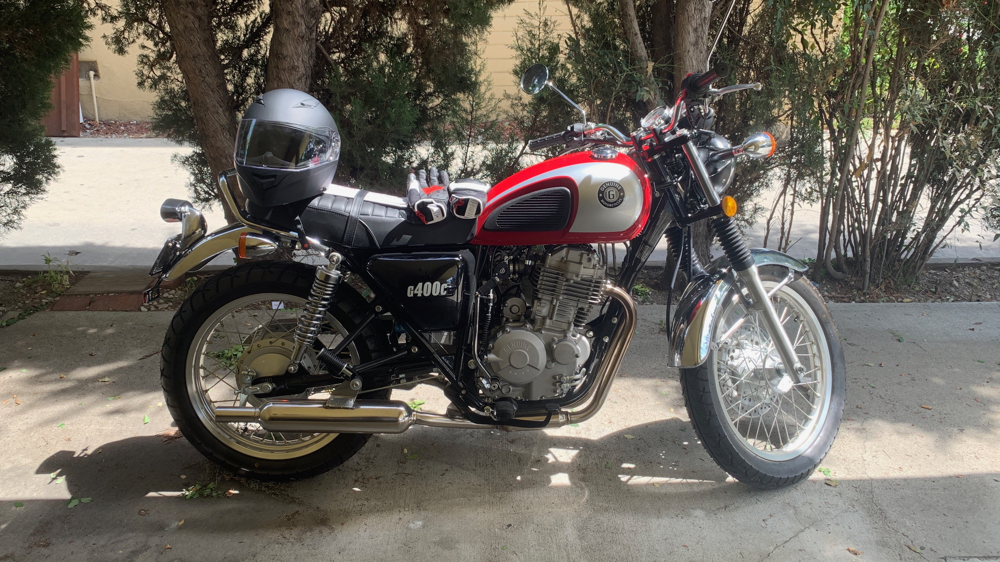

Hello! This is my weekly post where I talk about whatever I've been up to. This week, Life Saver TV went up on the App Store, and I began my first week as a motorcyclist.

---

## Life Saver TV

This week I released Life Saver TV on the Apple TV App Store. You can buy it for [the paltry sum of $2.99 over here](https://apps.apple.com/ca/app/life-saver-tv/id1470667717). I [wrote last week](/wiut-2019-week-26/) about some of the changes in it, so I won't rehash those here. I don't actually have a lot to say about it, as there's only been two sales (one of them is myself, and one of them is a friend) and I haven't done any promotion so I don't know what people think about it. I mean, I think it's cool! But we'll see, the proof is in the tasting or whatever. This next week I'll try doing some promotion and see how it shakes out.

---

## Taking A Programming Break

After the release of Life Saver TV, I figured it was probably a good idea for me to take a little break from programming. I've felt a little "stuck in gear" (as opposed to "stuck in Gere", like a gerbil) the past month or two, like I can't really relax because I have so much stuff to do. I'm trying to break that feeling, because I should be able to relax--all my ducks are in a row, I'm a "success" by any measure of the word, so what gives? Why am I always pushing myself harder?

It's also just a good time to take a break. While there's work I could be doing on [Aeon Garden](https://aeongarden.dev), for the most part my other projects are fine being "on hold". I want the rebuild of Numu Tracker to use Swift UI now, because why not? (Hopefully it doesn't exclude too many of my users, but since it's a free product it's not like I owe anyone anything.) And maybe it would be good to push off the work I want to do on Aeon Garden for iOS 13 as well, because I was looking at building a manual cloud sync service for it, but if iCloud Core Data works as good as others claim, it could do the job instead.

---

## Motorcycle! Week One

This was my first week as a motorcyclist. I picked up my bike (a [Genuine G400C](http://www.genuinescooters.com/g400c.html)) from [Scooter Dynasty](https://www.scooterdynasty.com) in Downtown LA on Tuesday, and as it was my first time riding a motorcycle on city streets, the ride home down Venice Blvd back to Culver City was fairly harrowing. Luckily, I never stalled out, so the embarrassment would come later on Thursday for my first official ride around town.

On that ride, I ended up stalling out _many_ times, which made me extremely grateful that I did not get a [Yamaha SR400](https://www.yamahamotorsports.com/sport-heritage/models/sr400), which are kickstart only. The G400C has an electric starter, so it's pretty easy to get it started again. There have been a couple times where I have stalled out several times in a row trying to get going again, holding up traffic behind me, and I couldn't imagine having to kickstart the bike every time I stalled it out.

On my second ride, I stalled out less and started to have a little more fun. On the third ride (this morning) I could definitely feel myself getting more comfortable with the bike. I stalled out _a lot_ less, to the point where I thought I wouldn't stall out anymore--but then I still did eventually. I think my clutch hand starts to get tired and I start to get sloppy with my operation. I drove all over the place (from Culver City, to Venice, to Santa Monica, down to Playa Vista, then back home) and had a good time. I felt like I could have gone for longer, but I didn't want to push myself too hard.

I'm probably going to start taking it on my commute to work (all 8 minutes of it) this next week, but I'm still a little worried about traffic. There was a point this morning where I stalled out making a left turn, which led me somewhat stranded in the path of oncoming traffic, panicking, which made me stall out the bike several times in a row as I tried to get out of the street. Not a good look, and not a good time. I figure when the bike stalls out I really should pull the clutch in and try to use whatever forward energy I have to roll out of the street, but in a panic that didn't occur to me and I ended up shuttering to a stop before I got it moving again.

Overall, riding a motorcycle seems like a lot of fun. The first two days were mostly scary, but this third day I was starting to have more fun on it. One big plus to motorcycling is that it demands your full attention at all times, so there's something really "mind clearing" about it, in a meditation sense. My mind is usually racing with all the things I could do or should be doing, but when I'm riding a motorcycle I can't think about any of that stuff because I'm too busy operating the machine and keeping myself safe (and alive). That's really great for me.

I might not blog too much about motorcycling once I get more comfortable, but who knows! Maybe I'll go on some cool rides and post pictures. 😎

---

That's really about it for me this week. See you next week!
