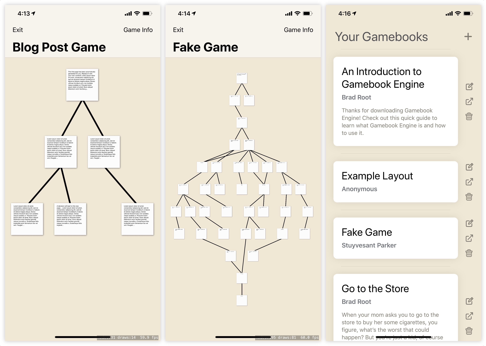

Hello! This is my weekly post where I talk about what I did over the past week. I'm spending basically literally all of my free time on BRGamebookEngine, so I hope you're prepared for another post about it!

---

## BRGamebookEngine

Work on "Gamebook Engine" continues. Last weekend I talked about how I'd hoped to submit a beta to Beta App Review. Well, that didn't happen. If I had put the pedal to the metal, I could have gotten it done. But it was a holiday weekend, and I ended up taking a bit of a holiday, though I still worked on it every day.

I decided early in the week that I wanted the app to have an "overview" mode, much like how [Twinery has this view](https://twinery.org/homepage/img/twine1-zoomedout.png) (and several other editors have similar views). I'd never built anything like this before, though my fairly firm footing in SpriteKit made me feel like I had the tools necessary to take a stab at it. It was really daunting, and I wasn't really sure how to go about it.

I asked for suggestions on Reddit's iOS developer subreddit, but people weren't much help. I decided to go with my instincts just to see what would happen. What were those instincts? Well... I decided that I wanted to built it much like a node tree map, kinda like [the graphic with the circles on this page](http://sujitpal.blogspot.com/2006/05/java-data-structure-generic-tree.html), where there are clear descending levels. It just kind of made sense to me that *most* games are going to be fairly linear top-to-bottom stories and that I didn't need to get too fancy with it. That gave me the clear idea that there are "rows" of pages, and that I can likely recursively populate a dictionary with each row.

On top of that I decided it would be good to have some method to separate 'related' pages from each other, by grouping pages within a row based on their common ancestor. After a lot of experimentation, I came up with a recursive method that ends up building a dictionary that looks a bit like this...

```json 
{
    0: {
        0: [page1]
    },
    1: {
        0: [page2, page3]
    },
    2: {
        0: [page4, page5], 
        1: [page6]
    }
}
```

Once I've got this generated, I use it to draw some pages on the screen in various levels. This part is boring. After I get all the pages drawn in their correct positions, I draw lines from them. Lines that descend get drawn in black, and lines that ascend (going back up to other pages) are drawn in gray. Right now they're just straight lines, but obviously it would be good to draw them in some fancier way in the future.

There are *a lot* of caveats drawing the page map this way, but most of them are edge-cases so I am considering this "good enough" for now. Certain complicated cases will draw kind of funky, but they're really not things that should be encountered "in the real world" when building real games using it. Considering this is the sum total of about 8 hours of work, I think it's pretty good for a working prototype.

Here's two screenshots, one of a story that looks like the JSON above, and one that is much more complicated. Please note these are unfinished screenshots, and what's inside the boxes is going to be a bit fancier than just some text. You can zoom in really close, and zoom out pretty far, and it's pretty neat all around.



I've spent a bit of time trying to polish up some of the UI this weekend, well before I really meant to, but I can't help myself. The third screenshot up there is where I'm at so far with the main view of the app, the game list. I decided I wanted "always on screen" functional UI. I'd implemented everything using swipe actions on table rows originally, and it was just really annoying to have to swipe all the time do to anything. I also got a nicer design for the "player" view partially in place. You can see some of it [in a video I posted on Twitter](https://twitter.com/amiantos/status/1170503764001746944) last night.

I'm in the final stretch to get to "beta" now, well technically the "alpha", but it's kind of hard to decide what level we're at. I guess alpha, because the code is still a big mess, but we're further along than I planned to be at this point. Everything that remains to be done is sort of minor decisions and implementations, plus some more design stuff.

I haven't really decided how I am going to promote the app or what my plans are really. I mostly just wanted to build a cool thing, kind of like the other cool things I have built. I guess we'll see what happens! That's it for me this week. See you next week!
