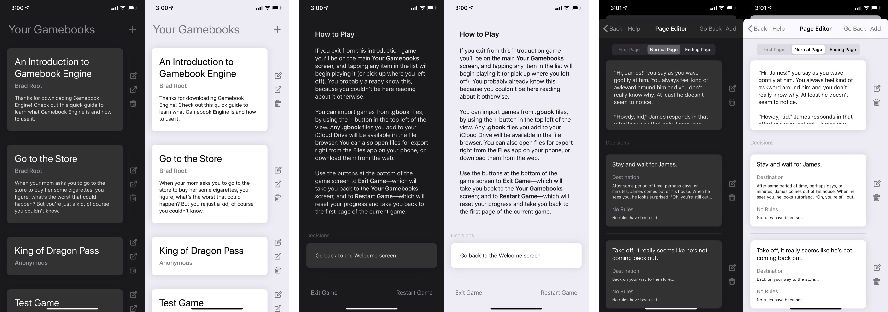

Hello! This is my weekly post where I talk about what I did over the past week. This week was really just a big continuation of work on BRGamebookEngine, yet again, for the fourth week in a row I think.

---

## BRGamebookEngine

This week was the iPhone announcement, which means iOS 13 is right around the corner. This meant I got to download Xcode 11 and get BRGamebookEngine ready for all the new stuff. Mainly this means dealing with [the new presentation style changes](view controller presentation changes in ios 13) and [supporting dark mode](https://schiavo.me/2019/implementing-dark-mode/). Both those articles are a great places to get info on how to do both of these things in your own app.

Here's some screenshots of Gamebook Engine, showing the light and dark mode versions of a couple main screens.

Otherwise, the primary thing I worked on this week was figuring out different designs for each screen and getting everything implemented. The app is almost 100% done in regards to a first alpha or beta or something. In a lot of ways this is the more tedious, less exciting part of app development. After the initial rush of getting a project into working condition, it can become a bit of a slog to get through the rest. This is what they mean about "the first 80% and the second 80%" I suppose. You're like "I'm almost done!" but then the yawning expanse of what has to happen to make a _real_ app that other people will do stretches out ahead of you.

It's not even just the polishing of the app that's daunting enough on its own, but you've got to take screenshots for the app store (Two sizes of iPhone + two sizes of iPad), write product copy, get a website prepared or at least a [single page with a privacy policy](/gamebookengine), make a promo video, make a help video, decide how you're going to promote the app, and so on. It's a lot of work!

But I'm still a ways off. I'm trying to slow myself down a little, 'cause I got into a "just get it done!" mentality that started to wear me out, especially when I started to realize how much work there was left to be done. The code at the moment is still a big mess, without much in the way of separation of concerns. I've implemented one thing so far that is definitely a kludge for now that I'll have to clean up later. I still have to write a _good_ 'sample story' that comes bundled with the app. I'm thinking I need to read a couple childhood Choose Your Own Adventure stories just so I can write one that's more accessible than whatever literary nonsense I'll pretentiously churn out by default.

---

That's about it for me this week. Nothing too exciting! See you next week.