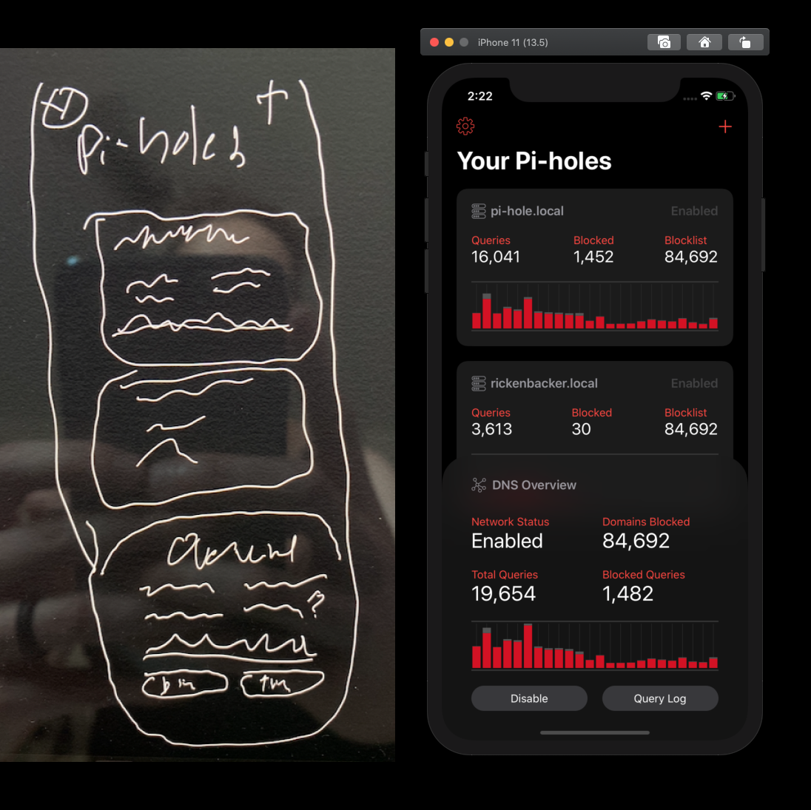
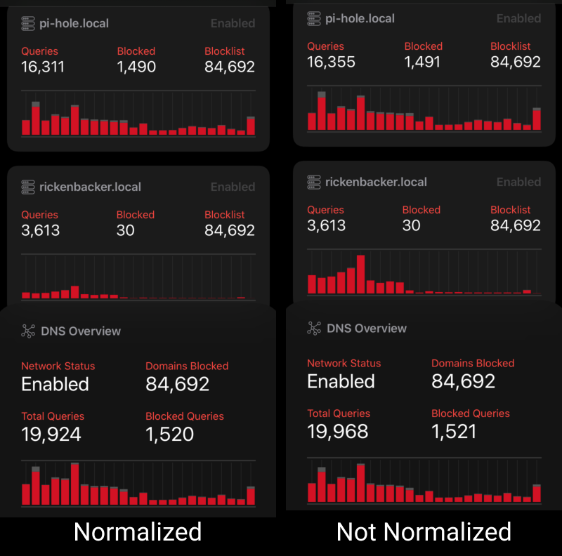

Howdy! This is my weekly post where I write about whatever programming-related stuff I got up to in the past week.

---

## PiBar for iOS

This week I began work on PiBar for iOS. This is, in many ways, a much larger project than PiBar for macOS, just by virtue of there being a lot more going on in an iOS app than a macOS menu bar app. With the macOS app the design is pretty straightforward, since it's just a menu bar app, and so the biggest "design challenge" comes from how to build out the preferences screen. Not much of a challenge at all. On the iOS side, the design is more complicated because I'm designing every screen and having to reconsider how all the other screens work.

Late last week I had a vision of what I wanted the app to look like, so I sketched it out on my iPad. A couple days later, I got to work. Here's a fun side-by-side example of my original sketch and what the current implementation of it looks like.

As you can likely see, I didn't use Figma or any wireframing app to do design prototypes. It's not that I never do, just that I usually don't. I enjoy iterating and implementing a design directly in Interface Builder (or programmically, though very rarely) so that's my process. I probably didn't really need to sketch the app idea down, but it was a little useful in terms of just committing my idea to some sort of solid record I can reference later.

As far as implementation goes, I'm using one Xcode Workspace to handle both projects, so I can use the backend functionality I built for the macOS app in the iOS app. This saves me a considerable amount of time, and meant that this week I was able to focus exclusively on getting the basic interface for the iOS app in place, because all the processes needed to handle refreshing Pi-hole data and sanitizing it for my app was already done.

I know that "in the real world" you would want to build out a shared framework, and use that framework across both targets, but... I don't really care. I've reached a place in my programming career where I've realized that being super anal about your app's internal architecture and file structure doesn't really make the app any better. Yes, caring deeply about those things can, in some cases, make your app less brittle. But for a tiny app like this, I don't really need to bend over backward to make everything work smoothly. It works because I'm separating my concerns in other ways.

One very new piece of this project was getting charts in place for displaying Pi-hole load over time. By default, the Pi-hole API outputs "over time data" in 10 minute chunks, which looks pretty good on the web interface but is basically overkill for the iOS app. Instead, I'm doing some data sanitization (or normalization?) in the app, turning the 10 minute chunks into 1 hour chunks, so that my charts have 24 bars each. On top of that, I'm creating a combined chart for all the Pi-holes you've added, and keeping track of the maximum hourly value for DNS requests so that all the charts can optionally be "normalized", so you can easily visualize how traffic is being distributed between your Pi-holes. Here's a shot that shows this idea better:

As you can see, the "normalzed" chart lets you visually see at a glance that the "rickenbacker.local" Pi-hole instance is not fielding much traffic, while the "not normalized" chart doesn't really make it obvious that there is a considerably different amount of load being sent to that Pi-hole. This'll be a feature you can toggle on and off in the preferences, because I feel there will be people who would prefer the "not normalized" version for some reason or another.

To generate the charts, I'm using the very popular iOS [Charts](https://github.com/danielgindi/Charts) library. I'm pretty impressed with this package, because it basically works right out of the box very easily. There's one downside: You can't have your chart bars have rounded corners. Over the years there have been several pull requests made to try to implement rounded charts in the library, but none of them have gotten off the ground due to a variety of issues and PR authors simply vanishing. I am somewhat tempted to throw my hat into the ring and see if I can get it in there for real, but I've kind of surrended myself to non-rounded charts. I think they look kinda nice in the app as it is anyway.

Because I've only implemented the most basic interface for the app so far, I don't have much else to talk about. There's **a lot** of work left to be done. I assume I'll get through a lot of it over the next week, so you can look forward to a lengthier post next week possibly.

---

That's it for me this week, see you next week!
