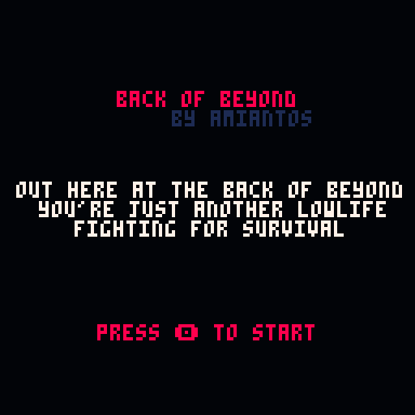
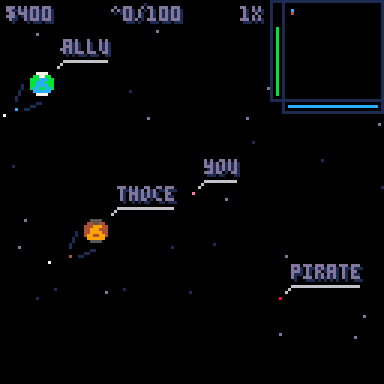
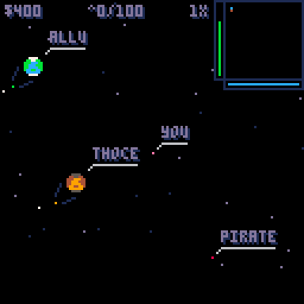
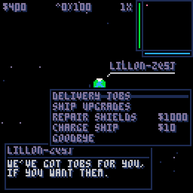
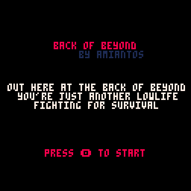

Howdy! This is my weekly post where I write about whatever programming-related stuff I got up to in the past week.

---

## Back of Beyond (a.k.a Space Game)

Boy howdy, I put a lot of work into "Space Game" this week, complete with giving it (what I think is) a final name: "Back of Beyond".

While reading Mikhail Bulgakov's "A Country Doctor's Notebook", in one of the stories he refers to the backwater country town he's in as "the back of beyond", essentially an idiom of "middle of nowhere" I'd never heard before. I thought it sounded interesting, and a little awkward to say, making it a perfect for one of my projects.

I even made a temporary title screen with the name:



### Pirates!

When I wrapped up [last week](/wiut-2020-week-47), I had the basic framework for both the overworld and the shmup mode in place. I said that the next step for me would be to get pirates on the overworld, and that's what I did. The first step was to get a pirate to draw on screen, which was pretty easy. After that, I realized the pirates needed to be doing something in their spare time, so... maybe circling as if they're patrolling a portion of space?



To get this 'circling' effect, I googled around and found this Lexaloffle BBS user blog called [Making things move in a circle](https://www.lexaloffle.com/bbs/?tid=29094). I was quickly able to adapt that code into something that'd make my pirates circle, both in random radii and random directions (clockwise and counter-clockwise). Easy! After that, I needed to get them to chase you down when you moved within their 'range of vision'. That was pretty easy to implement as well, here's an example:



Some (temporary) finishing touches for pirate development included: ensuring that when pirates get close enough to you, battle automatically initiates; after defeating the enemy in 'shmup mode', you get dropped back into the overworld and the pirate you fought disappears. I also needed to randomly scatter pirates around the galaxy. All of these are just temporary, simple implementations that need to be replaced later. You'll see in that gif above there are comms when a pirate catches up to you, those didn't exist yet at this stage...

Before I started working on 'comms', I made a couple minor UI changes you can see above. Namely, I added a 'magnification lines' effect to planets, so that the sprite of the planet appears to be a zoomed-in view of a tiny pixel representing the planet. Once I had the pixel planet in place, I wanted each planet to have a 'star', so that involved two things: 1) draw a star randomly around the pixel planet, and 2) re-calibrate the overworld background parallax effect to make these stars the 'top' layer, and all background stars move more slowly than them. It took some fiddling, but it works and it looks very nice! You can see it above in the other gifs.

### Comms UI

After implementing pirates, it felt like the next logical step for me was to implement the ability to refuel and repair your ship. This meant I had to figure out how to design and implement a menu system, something I've never done before entirely on my own. Since my background is RESTful API development (no UI) and Apple products (prefab UI frameworks), it would be a new experience for me to build something without standing on the shoulders of giants. Unlike with other challenges, I didn't google anything and set straight to work.

To pat myself on the back: I think I came up with a flexible, reusable solution that can handle all the menus in my game. I'm going to try to explain it right now in a clear way, without giving too many direct code samples to refrain from boring you.

Basically, there are a couple global variables at play. `comms_open` determines if the comms UI should be drawn to screen, this is `true` or `false`. `comms_title` determines the title of the comms message window. `comms_str` determines the message that appears in the window. `comms_options` is a table that contains the content of the 'options' picker. `comms_selected` keeps track of which option is currently highlighted by the player, who can change options by pressing up and down. Before I get into more detail, here's an example of the comms window in action:


Really, the meat of comms lies in that `comms_options` table. It might help to explain it just by showing the format of the options.

```lua
--comms option format
--{
-- menu label: str,
-- function to call: func,
-- functions args: table,
-- on hover text: str or nil
-- post-selection text: str or nil
--}
--examples:
{
  {
   "goodbye",
   close_comms,
   nil, nil, nil
  },
  {
   "repair shields",
   repair_ship,
   {cost=1000},
   "you look like you could use some repairs.",
   "i'll get my people to work on your ship immediately."
  },
  {
   "delivery jobs",
   jobs_comms,
   nil,
   "we've got jobs for you, if you want them.",
   "can you deliver these goods? good money in it for you, if so."
  },
  --job example
  {
   planet.name,
   take_job,
   {
    cost=354,
    planet=planet,
    scu=456
   },
   "take this package to " .. planet.name,
   "the job is yours!",
  }
}
```

To explain more in-depth: the first item in the table is the name of the option as it should appear in the menu. The second item is the function that should be called when that item is selected. The third item should be a table of attributes that is passed to the function when it is called (and can be used for showing extra detail in the option, like cost or cargo size [scu]). The fourth item is the text that should appear in the comms window when that option is highlighted, and the fifth is what should appear when the option is selected.

From there, it's a simple matter of setting the `comms_options` table up with the options that you want, and setting `comms_open` to `true`. For example, when a pirate catches up to you (like in one of the above gifs) this is basically the content of the function that is called:

```lua
function pre_battle_comms(pirate)
 comms_options={{
  "let's fight!",
   begin_battle,
   {enemy=pirate},
   nil,
   nil,
 }}
 comms_selected=1
 comms_title="pirate"
 comms_str="i'm gonna mash you good, small fry!"
 comms_open=true
end
```

When the user presses up and down to cycle through the options, the current index of their selection is saved in `comms_selected`, when the user presses 'x', the option is looked up in `comms_options` by that index, and the function is called with the argument passed in, like so: `comms_options[comms_selected][2](comms_options[comms_selected][3])`. It's not super pretty, but it works :)

The rest of the implementation really just involves drawing the UI for the comms and options to the screen, which isn't very exciting. If you really want to look at the code, and I warn you there are areas in need of refactoring that I haven't gotten to yet, I've set up a [secret gist of my comms.lua file](https://gist.github.com/amiantos/b3a80e8aec534f768b687a53028e4d19) for you to take a look.

It was a surprisingly huge amount of fun to design and build this menu system, and it works really well for my game. All in all, building it was fiercely rewarding and I'm really proud of it. There's a nice hidden feature: if you're being chased by a pirate, if you can reach a planet before they can catch you, you can activate comms (which freezes the overworld), quickly repair your ship, and then close comms to go into battle. I like it! A little bit of player-friendly cheese built in.

After I got the menu system working, it was pretty easy to get a 'recharge ship' feature working planet-level... after getting some sort of 'money' system in place, which I am simply calling 'cash', and using the $ dollar sign symbol to represent it. (Really, when I think in terms of 'in universe lore', it makes sense to me that USD would somehow turn into the galactic form of currency.) Now that I could successfully fly between planets and recharge my ship, it felt natural that the next feature I'd work on would be delivery jobs.

### Making Deliveries

At this point it's worth saying that the project is starting to diverge a little from my original vision. I didn't *really* plan on there being delivery jobs at each planet, but as I built the game out, it started to feel like a natural fit. I think it's important when building any project on your own, app or game, that you feel confident in following your whims. What you end up with at the end might not be exactly what you thought you wanted, it might be better! And if it's worse, well, back up, and do it differently.

At first, I implemented delivery jobs very simply: pick a random planet, calculate the distance to it ([using this method](https://love2d.org/forums/viewtopic.php?p=19962&sid=b1f79ee9215e73c1073f7da85de4debe#p19962), basically), and set the reward based on the distance. As soon as I tested this, however, I realized there was nothing stopping me from just grabbing every delivery job and cheesing the game. Whoops! Looks like I need some sort of limiting factor to prevent this.

How about weight? Simple! I implemented weight. Each delivery job has a weight, and your ship has a max weight it can carry. This seemed to work well, but late at night as I was falling asleep I realized... the ship never lands, it's always in space, why would weight matter in space? Space is weightless! It seems like volume would be the true limiting factor, but "cubic feet" seems very long winded. What to do?

I realized that Star Citizen has probably solved this problem already, so I turned to google again, and yes, Star Citizen uses a measurement called SCU: [Standard Cargo Unit](https://robertsspaceindustries.com/comm-link/engineering/16204-The-Shipyard-SCU-And-Cargo-Capacity). That blog post is really long winded, so I didn't read it, I just took the idea of "SCU" and ran with it, renaming some functions and flavor text to match, and settling on the `^` caret to represent it in the UI.

So now the payout of each delivery is determined by the distance needed to travel (as the crow flies) multiplied by the cost of charge per unit of distance, and the total SCU of the delivery multiplied by another factor to act as the 'bonus' for the delivery.



After getting the delivery jobs in place, it was pretty quick work to implement the ability to actually *make* the deliveries to the other planets. At this point, the game was relatively playable: you can pick up deliveries and take them to other planets, while trying to avoid pirates (even though the SHMUP combat is not in place). This was when I realized I inadvertently designed "Death Stranding in Space". Whoops! But Death Stranding is a great game, so I don't mind subconsciously paying homage to it.

There's some little UI tricks to make working with deliveries nice: when you're browsing deliveries, the planet the delivery goes to is highlighted in the mini-map by a flashing target. When you've taken on a delivery, the location of the planet flashes on the UI so you know you've got deliveries on board for that planet.

### Screen Transition

Yesterday, over on the [Pico-8 Discord](https://discord.gg/q8GPuU2F5t), I saw people talking about screen transitions. I hadn't really thought about them before, though I knew my game would need them for that perfect level of polish. When I saw the discussion, it set my brain to work, and I came up with a method of handling transitions in my game that I thought would be really cool. Just to cut to the chase, this is what the finished transition looks like:



Looks nice, doesn't it? A slightly slower version [got a lot of love](https://twitter.com/amiantos/status/1332878880084922368) over on Twitter, which was very nice.

Anyway, my realization was that I'd need an 'intermediary' layer that can hold the new init, update, and draw functions for the next game mode, so that I can simply draw the transition effect over the last frame of the prior game mode, and when that frame has been completely obscured, I can start drawing in the next game mode, while drawing the transition over it.

Instead of posting a bunch of code snippets in here, I've simply [created a gist for bob_transition.lua](https://gist.github.com/amiantos/4ee1ac79a49f971da92a2edc9fee15ad) so you can look at the code yourself. Basically: from any game mode, you can call `change_mode` with the integer that refers to the mode you want to switch to. So to switch to the game over screen, you'd call `change_mode(4)`.

Once activated, I have all black lines draw over the screen, with random starting points so the effect is uneven and not just a moving vertical line. Once the entire screen has been drawn over, the start point of those lines is moved back to their original starting position, and the lines are drawn again, but this time instead of expanding across the screen from right to left, they collapse from right to left, to reveal the new mode underneath. The star parallax is handled separately, drawn over the top of the transition, but only in areas that are covered by the black lines.

It took a lot of fiddling, around 3 hours of experimentation to get it where I wanted it. I can't argue with the result though, it looks and feels *very* nice.

### Ship Upgrades

Since your main way of generating income is now in place, it felt like the next logical step was to allow you to upgrade your ship. Originally I had planned on there being "upgrade items" that you could buy and sell, and that you'd harvest off destroyed enemy ships, but I decided ultimately to KISS ('keep it simple stupid') and have ship upgrades work similarly to increasing stat attributes in an RPG.

The menu system made this pretty easy to implement. When you select the upgrade menu, a function is called that generates available upgrades depending on your ship's current stats. For example, this is how the storage upgrade is created:

```lua
--make scu booster
local amt=min(1000, 100+((ship.max_scu-100)*1))
local cost=min(9999,1000+((ship.max_scu-100)*12))
add(comms_options,{
 "scu retrofit" ,
 buy_scu_boost,
 {amount=amt,cost=cost},
 "this will expand your maximum cargo storage by " .. amt .. " scu.",
 "my boys are done wrenchin', you're good to go!"
})
```

These are just preliminary numbers. To explain one thing to astute observers: I decided the comms UI doesn't support numbers beyond 4 digits, so that's why the cost of any item maxes out at 9999.

Each of the 'buy' functions for the sales options looks something like this:

```lua
function buy_scu_boost(table)
 if check_cash(table.cost) then
  ow_ship.max_scu+=table.amount
  del(comms_options,comms_options[comms_selected])
  buy_comms()
 end
end

function check_cash(cost)
 local new_cash=ow_ship.cash-cost
 if new_cash<0 then
  comms_str="sorry, you ain't got enough cash for this upgrade."
  return false
 end
 ow_ship.cash-=cost
 return true
end
```

That `check_cash` function is some great refactoring, used in every buy function. Always DRY up your code if you can! (DRY='don't repeat yourself')

After getting this in place, essentially the full overworld gameplay loop was in place, and I spent some time playing my game. It's fun! But it'll be more fun when combat is in place. Right now it's very much "Death Stranding in Space", but with no hazards at all, so you're just schlepping cargo back and forth between planets, racking up cash, and buying upgrades so you can fly faster, further, and carry more cargo.

### Phew... what's next?

And... that's it. That's what I did this week. I spent basically most of my waking hours over the Thanksgiving holiday weekend churning out code on this project, and it was a ton of fun. So, what's next?

Well... I need to build out the SHMUP mode for combat, and weapon upgrades. I'm still not sure how I want to handle weapon upgrades. The comms system would likely lend itself pretty well to some sort of 'ship management' UI, but I kind of want to avoid that just to keep the game simple. I'm also concerned I am starting to run low on tokens, I'm currently at 5411 tokens out of the 8192 limit. 2,800 tokens is still quite a bit, but I'm sweating it.

On top of that, I wanted there to be a secondary hazard, like an asteroid belt. This'll reuse the SHMUP mode, but instead of pirates attacking you, they're asteroids you have to avoid or try to blow up (if you have the firepower). I'm worried there won't be room in the cartridge for this mode, but we'll see what happens.

---

That's it for me this week, see you next week!
