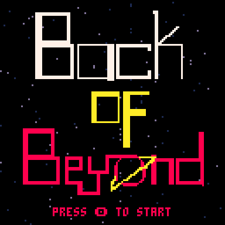
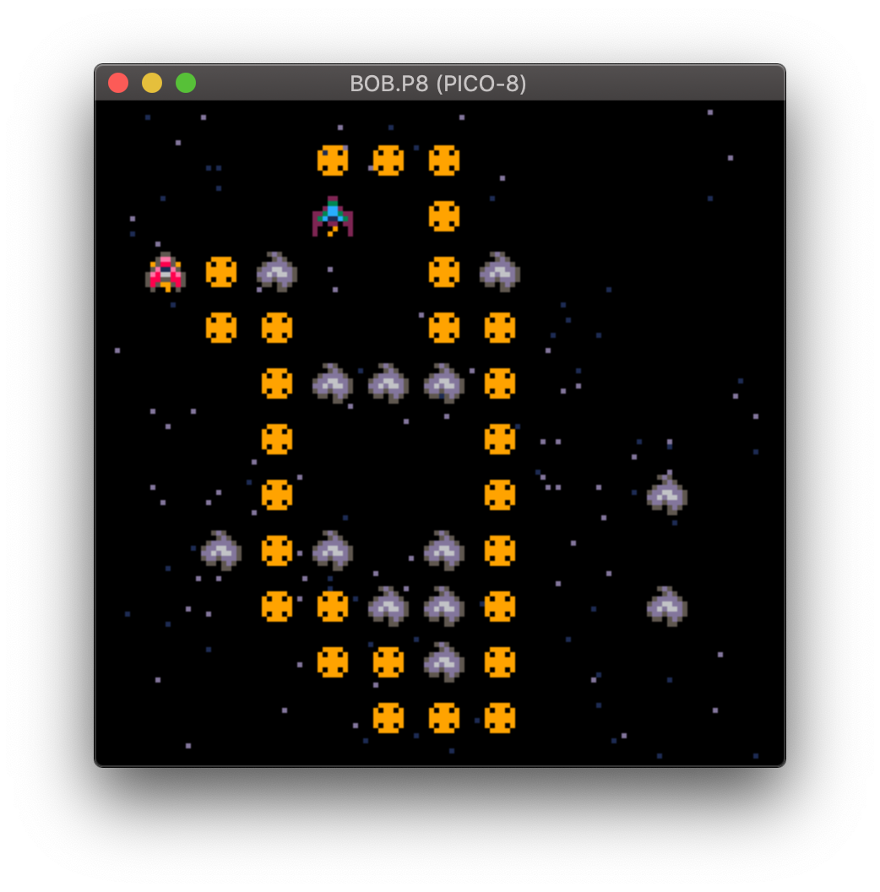
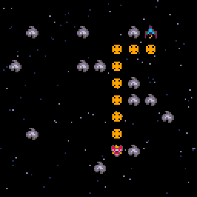
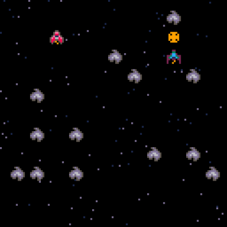
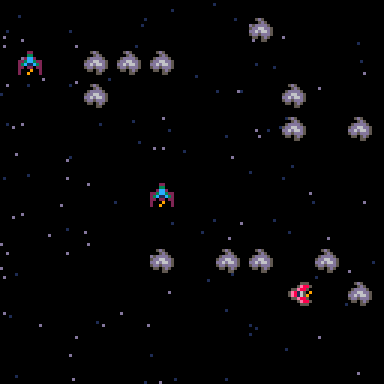
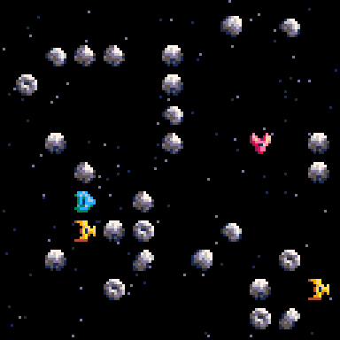

Howdy! This is my weekly post where I write about whatever programming-related stuff I got up to in the past week.

---

## Back of Beyond

Phew, what a week. On Sunday night, my wife drew a title screen logo. I'd found [Pixel Studio for iOS](https://apps.apple.com/us/app/pixel-studio-for-pixel-art/id1404203859) on the App Store, because I wanted to try drawing the logo on the iPad Pro with Apple Pencil, but my wife took it over and zoned out into it. This is the result:

I dig it. I think it's got a nice bauhaus feel to it that matches up a bit with the soviet-era sci-fi I've been reading lately.

On Monday night, after a discussion with my friend [Dan](https://twitter.com/dancrum), I decided to give up on the SHMUP combat combat and try something else. Why not SHMUP? Well, I don't really like SHMUPs personally, usually, so I wasn't confident I could make a good one. Also the SHMUP format didn't really make sense for small scale 1v1 or 2v1 ship battles.

I decided that maybe a grid-based roguelike sort of combat would be fun to implement and could be fun. Little did I know that this would be actually be very challenging. First I had decide on the size of the grid, I settled on a 11x11 grid, so not the full screen, sized in such a way that each 8x8 sprite would have an extra pixel or two of space around it.

After that, I got the player ship on screen and moving around, drew some enemy ships on screen, and some asteroids (to act as obstacles) too. Then the hard part began: how to get enemy ships to navigate the grid to line up shots on the player ship. I figured step one was to get some sort of pathfinding to work, so around 6pm on Tuesday I started researching pathfinding stuff, and spent the next 5 hours completely hypnotized by constant failure to implement anything that would work.

At one point I ended up with pathfinding that I'd only describe as "worst case scenario" pathfinding, for example (the determined path between enemy and player ship is highlighted in yellow):

Finally, I stumbled on this [Roblox tutorial on Dijkstra's algorithm](https://developer.roblox.com/en-us/recipes/dijkstra-s-algorithm) and with the help of that, I was finally able to figure it out. Check it out:

This is good and all, but in actuality I don't want the ships to go directly to the player ship. I want them to try to establish line of sight so that they can shoot the player ship. After puzzling for this a little bit, I realized the simplest solution is to start at the player ship, and build a list of empty spots radiating out from there until an obstacle is hit. Those would be all the spots that an enemy could move into to get a clear shot on the player.

Then, I run that list through the pathfinding algorithm, and sort all the destinations by the path's distance, and pick the closest one and have the enemy try to move there. Here's an example of that implemented, notice how the enemy ship is only showing path up to where LOS is created:

Once this got wired up, the next challenge was to figure out how to actually handle the turn based nature of combat. It took me a bit, and at this point I don't even find the solution all that interesting, but just because here's an example of turns in action:

At this point I decided this was far enough along that I should try redrawing the sprites and adding more asteroid variety. I ended up drawing an additional 'cargo' friendly ship, and I went for a shaded kinda bubbly retro futuristic look for them. I don't consider myself much of an artist, but I like them. There's four sprites for each ship so as they turn the lighting effect stays at the same angle.

Unfortunately at this point I'd used up close to 3,500 tokens in the pico-8 cart and was closing in on the last 1000 tokens. I felt like I had a long way to go to make it fun, and I was itching to implement another new feature in the overworld mode.

What's the new feature? Well, while I was talking to Dan, I thought that to make the overworld seem more alive there should be other ships delivering cargo, why is it just you flying around and no one else? Dan then suggested you could attack those cargo ships, and I suggested you can come across pirates attacking cargo ships and choose to defend them or join in and try to steal the cargo ship from the pirates. Something like a moral mechanic rises naturally out of this, where you can decide make your money legally by delivering cargo, or make it by robbing cargo ships. Sounds cool to me!

Also, the same problem came back again: I'm not really that into roguelike style combat like this, either! I felt like there was no way to make it especially fun. So last night I decided I was going to throw away the three days of work I spent on the grid-based combat and start over again, going back to my influences and build in an Earthbound-style, JRPG-esque, RPG combat system. Mostly menu-based, with some light animations to depict the fight.

I think that I'll be able to fit this idea, implemented properly, into the cart. I guess we'll see! I'm a little worried that I am still biting off more than I can chew, but that's half the fun of developing for PICO-8 (I guess).

---

## PiBar for iOS

Whoa! PiBar news? Yes! My co-worker and friend has finished his updates to the PiBar logo, so I should have the iOS app icon in my hands this week. I really just need to implement the query log feature, and then I can get the app into Beta App Review and start letting people use it. Exciting!

I also applied for the Apple Small Developer Program or whatever it's called, where they will reduce their cut to 15%. I make a tiny bit of money every month from PiBar, and this change likely won't increase it very much, but beggars can't be choosers! I will take what I can get. I figure I'll get PiBar for iOS out on the App Store around the same time the change goes into effect. 💰💵🤑

---

That's it for me this week, see you next week!